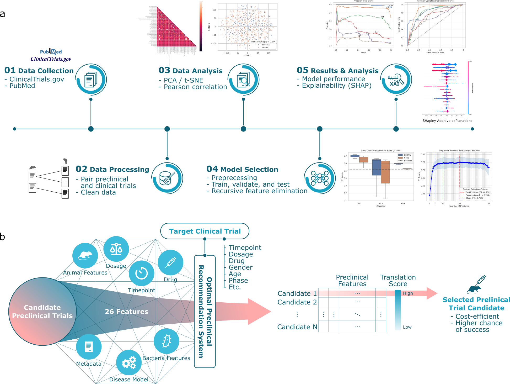

# Predicting Preclinical to Clinical Translation for Clostridium difficile Infections

Abstract: Preclinical models are ubiquitous and essential for drug discovery, yet our understanding of how well they translate to clinical outcomes is limited. In this study, we investigate the translational success of treatments for Clostridium difficile infection from animal models to human patients. Our analysis shows that only 36% of the preclinical and clinical experiment pairs result in translation success. Univariate analysis shows that the recurrent endpoint is correlated with translation failure (SRC=-0.20, p-value=1.53 x 10<sup>-54</sup>), and explainability analysis of multi-variate random forest models shows that both recurrent endpoint and subject age are negative predictors of translation success. We have developed a recommendation system to help plan the right preclinical study given factors such as drug dosage, bacterial dosage, and preclinical/clinical endpoint. With an accuracy of 0.76 (F1 score of 0.71) and by using only 7 features (out of 68 total), the proposed system boosts translational efficiency by 25%. The method presented here can extend to any disease and can serve as a preclinical to clinical translation decision support system to accelerate drug discovery and de-risk clinical outcomes.


**Figure 1. Overview of the preclinical recommendation system.** **a** We collect data from publicly available preclinical and clinical trial information about Clostridium difficile infection. This dataset, designated as A2H, is constructed by pairing the preclinical trial with the clinical trial that shares the same drug. A binary classification label is applied to each pair, where a translation is successful (label 1) if the preclinical survival rates and clinical recovery rates are within a threshold δ. Then, a machine learning pipeline chooses the best combination of feature selection, missing value imputation, outlier detection, and classifier. We report the model performance and feature interpretation and predictions. **b** For any specified clinical trial of interest, our system computes a translation score for each candidate preclinical trial. This score quantitatively assesses the potential for successful translation. The preclinical trial that emerges with the highest translation score is then preferentially chosen to inform the design of the ensuing preclinical study.

## 1. Directories

- [`data`](./data) contains the raw data used in this project.
- [`outputs`](./outputs/) contains the outputs generated by the code.
- [`scripts`](./scripts/) contains the shell scripts used in this project.
- [`src`](./src/) contains the Python source code used in this project.

## 2. Getting Started

The project has been tested to work in the following environments:
- Python 3.11.5
- Ubuntu 22.04

### 2a. Clone this repository to your local machine.

```console
git clone https://github.com/A2H.git
cd A2H
```

### 2b. Create an Anaconda environment.

```console
conda create -n a2h python=3.11.5
conda activate a2h
```

You can deactivate the environment with `conda deactivate`.

### 2c. Install the required packages.

```console
pip install -r requirements.txt
```

### 2d. (Optional) Reproduce the results by running the source code.

- For running the model selection pipeline:
```console
./scripts/run_msap.sh
```
Note that this script is dependent on the MSAP pipeline internally used by the authors. For this reason, you will not be able to run this script unless you have access to the MSAP pipeline.


### 2e. (Optional) Run the notebook demo.

Visit the [`notebooks`](./notebooks/) directory and run the Jupyter notebook `demo.ipynb`.

## 3. Authors

- Fangzhou Li<sup>1,2,3</sup>
- Jason Youn<sup>1,2,3</sup>
- Christian Millsop<sup>1,2</sup>
- Ilias Tagkopoulos<sup>1,2,3</sup>

1. Department of Computer Science, the University of California at Davis
1. Genome Center, the University of California at Davis
1. USDA/NSF AI Institute for Next Generation Food Systems (AIFS)

## 4. Contact

For any questions, please contact us at tagkopouloslab@ucdavis.edu.

## 5. Citation

Citation will be updated later.

## 6. License

This project is licensed under the Apache-2.0 License. Please see the [LICENSE](./LICENSE) file for details.

## 7. Acknowledgements

This work is supported by USDA-NIFA AI Institute for Next Generation Food Systems (AIFS), USDA-NIFA award number 2020-67021-32855.
